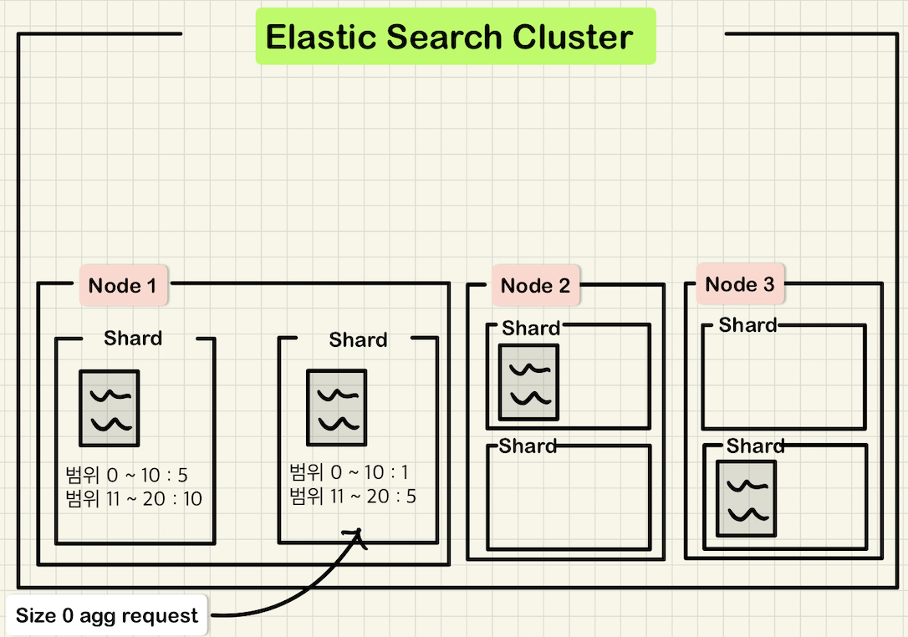
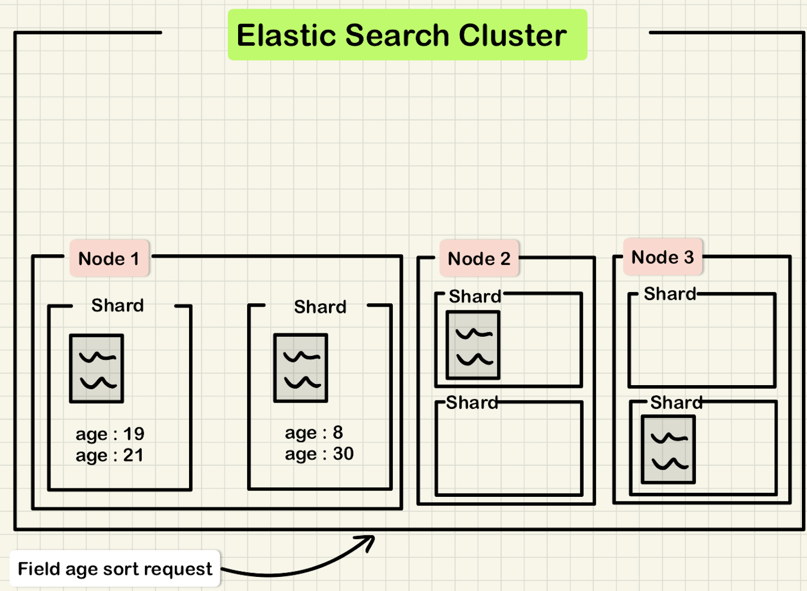

# 기초부터 다지는 ElasticSearch 운영노하우

## 11장 검색 성능 최적화
- ES 캐시의 종류와 특성
- 검색 쿼리 튜닝
- 샤드 배치 결정
- forcemerge API 활용
- 그 외 검색 성능 확보 방법

### ES 캐시의 종류 와 특성
- ES 는 다양한 검색 쿼리에 대해서 빠른 응답을 주기 위해 해당 쿼리의 결과를 캐싱한다.

`ES 의 캐시 영역`

| 캐시 영역 | 종류 |
| --- | --- |
| Node Query Cache | 쿼리에 의해 각 노드에 캐싱되는 영역 |
| Shard Request Cache | 쿼리에 의해 각 샤드에 캐싱되는 영역 |
| Field Data Cache | 쿼리에 의해 필드를 대상으로 각 노드에 캐싱되는 영역 |

#### Node Query Cache


- Node Query Cache 는 **filter context** 에 의해 검색된 문서가 캐싱되는 영역이다.
- filter context 에 의해 쿼리되면 각 문서에 0과 1로 설정가능한 bitset 을 지정한다.
  - 이는 사용자의 호출 여부를 마킹 하는 것
- ES 는 문서별로 bitset 을 지정하면서 사용자 쿼리 횟수와 bitset 1 인 문서간의 연관관계를 확인하고, 자주 호출되는 문서를 노드의 메모리에 캐싱한다.
- **검색 엔진에서 활용하기 좋은 캐시 영역**

> 주의할 점은, 세그먼트 하나에 저장된 문서의 수가 10,000개 미만 혹은 쿼리가 요청된 인덱스가 전체 인덱스 사이즈의 3% 미만인 경우 캐싱되지 않는다.

```shell
// 사용된 QCM (Query Cache Memory) 조회
curl -s 'http://localhost:9200/_cat/nodes?v&h=name,qcm'

name    qcm
ncucu-1  0b

// 1개의 샤드로 구성된 인덱스이며 2개의 문서가 저장되어 있음
curl -s 'http://localhost:9200/_cat/segments/users?v&h=index,shard,segment,docs.count'
index shard segment docs.count
users 0     _6               2
```

Node Query Cache 는 기본적으로 **활성화** 되어 있고, 활성/비활성화 설정이 가능하다.
- 이 설정은 dynamic setting 이 아니기 때문에 인덱스의 상태를 open/close api 를 통해 close 상태로 만들어야 한다.

> 캐시 메모리 영역이 가득차면 LRU (Least Recently Used Algorithm) 에 의해 캐싱된 문서를 제거한다.\
> 또한 각 노드의 elasticsearch.yml 설정을 통해 캐시 메모리 영역을 조정할 수 있다.

`elasticsearch.yml`

```yaml
indices.queries.cache.size: 10%
```

> 위 설정을 적용하면 노드의 재시작이 필요하며, 값 변경이 필요한 경우 충분히 테스트를 거친 뒤 변경해야 하낟.

#### Shard Request Cache



- Shard Request Cache 는 **샤드를 대상으로 캐싱** 되는 영역
- 특정 필드에 의한 검색이기 때문에 전체 샤드를 대상으로 캐싱된다.
- 이는 문서를 캐싱하는 것이 아닌, 집계 쿼리의 결과 / RequestBody 파라미터의 size 를 0으로 지정할 경우 쿼리 응답 결과에 포함된 **문서의 수** 에 대해서만 캐싱한다.
- 기본적으로 활성화 되어 있다.
- **분석 엔진에서 활용하기 좋은 캐시 영역**

> 주의할 점은, 샤드에 refresh 동작을 수행하면 캐싱된 내용이 초기화 된다.\
> 즉, 지속적인 색인이 발생하는 인덱스에서는 큰 효과가 없음.

```shell
// 사용된 RCM (Request Cache Memory) 조회
curl -s 'http://localhost:9200/_cat/nodes?v&h=name,rcm'

name    rcm
ncucu-1  0b0
```

> Shard Request Cache 는 **size 가 0** 이여야 캐싱된다는 점을 주의해야 한다.

Shard Request Cache 는 기본적으로 **활성화** 되어 있다.
- 이 설정은 dynamic setting 이기 때문에 인덱스를 대상으로 온라인 중 설정이 가능하다.
- 추가 적으로 검색 시 에도 활성/비활성화 설정이 가능하다.
- Node Query Cache 와 마찬가지로 캐시 영역 설정이 가능하다.

`elasticsearch.yml`

```yaml
indices.request.cache.size: 10%
```

#### Field Data Cache



- 인덱스를 구성하는 필드에 대한 캐싱
- 검색 결과 **정렬/집계** 쿼리 수행시 지정한 필드를 대상으로 해당 필드의 모든 데이터를 메모리에 저장한다.

```shell
// 사용된 FM (Fielddata Memory)
curl -s 'http://localhost:9200/_cat/nodes?v&h=name,fm'

name    fm
ncucu-1 0b
```

> Field Data Cache 는 Text 타입에 대해 캐싱을 하지 않는다.\
> Text 타입의 경우 비교적 데이터의 크기가 크기 때문에 메모리 과부하를 막기 위함이다.\
> 또한 집계를 수행한 필드의 모든 데이터를 메모리에 로드하기 때문에 집계 시 데이터의 양을 고려하여 사용해야 한다.

Field Data Cache 영역 또한 캐시 사이즈 지정이 가능하다. 

`elasticsearch.yml`

```yaml
indices.fielddata.cache.size: 10%
```


#### 캐시 영역 비우기

```shell
curl -XPOST -H 'Content-Type: application/json' http://localhost:9200/users/_cache/clear?pretty&${cacheType}=true

{
  "_shards" : {
    "total" : 1,
    "successful" : 1,
    "failed" : 0
  }
}
```
- cacheType 에 해당하는 값에 query, request, fielddata 가 올 수 있으며, NodeQueryCache, ShardRequestCache, FieldDataCache 순으로 동작한다.

> 인덱스 명 위치에 _all 을 사용하면 전체 인덱스를 대상으로 수행할 수 있다.

### 검색 쿼리 튜닝

`필드 관련`
- 검색 성능을 떨어트리는 요인 중 하나는 **너무 많은 필드를 사용** 한다는 것이다.
- 매핑 구조에 따라 필드가 많아지는 경우가 있어 많은 필드를 사용해야 하는 경우가 있는데, 이런 경우 **copy_to** 를 사용하면 하나의 필드로 모아 검색이 가능해진다.

`match 대신 term 쿼리를 사용하자`
- match 쿼리는 Query Context 에 속하기 때문에 애널라이저를 통해 검색어를 분석하는 과정이 필요하다.
- 반면 Filter Context 에 속하는 term 쿼리는 검색어를 분석하는 과정이 없고, 결과를 캐싱하기 때문에 성능상 우위에 있다.

> 추가적으로 숫자형 데이터이지만, 더하거나 뺴는 연산이 필요없는 데이터의 경우 keyword 타입으로 지정할 것을 권고한다.\
> 사번이나 계좌번호 등과 같이 정확히 일치하는 문서를 찾는 쿼리의 경우 term 쿼리를 사용하는 것이 이점을 갖는다.\
> 보통 숫자형 데이터는 연산, range 와 같은 범위검색에 최적화 되어있으므로 해당 필드의 성격에 따라 데이터 타입을 매핑하는 것도 중요하다.

### 샤드 배치 결정
- 샤드를 적절히 배치하여 인덱스를 설정하는 것은 매우 중요한 문제이다.
- ES 는 프라이머리를 한번 지정하면 변경할 수 없다.
- 따라서 최초 설정시 매우 신중해야한다.
- 다음은 클러스터의 샤드 배치를 잘못 했을 경우 발생할 수 있는 이슈

1. 데이터 노드 간 디스크 사용량 불균형
  - 노드의 수에 맞게 인덱스 샤드의 수를 지정해야 하낟.
2. 색인/검색 성능 부족
  - 샤드의 수가 너무 적을 경우 악영향을 미친다.
3. 데이터 노드 증설 후에도 검색 성능이 나아지지 않는다.
  - 샤드의 개수와 노드의 개수가 맞지 않는 문제
  - 이런 문제를 해결하기 위한 하나의 방법은 **노드 개수의 n 배로 샤드를 지정** 하는 것
4. 클러스터 전체의 샤드 개수가 지나치게 많다.
  - 클러스터 내 샤드가 많아지면, 마스터 노드가 관리해야할 정보도 증가한다.
  - 이는 마스터 노드의 힙 메모리 사용량이 증가 한다.
  - 만약 데이터 노드 사용량의 문제가 없는데 성능이 저하된다면 마스터 노드의 성능을 확인해야한다.

### forcemerge API
- ES 의 데이터 구조를 보면, 인덱스는 샤드로 분할되고 샤드는 다시 세그먼트로 분할된다.
- 세그먼트는 특정 시점이 되면 다수의 세그먼트를 하나의 세그먼트로 합치는데, 세그먼트가 잘 병합되어 있다면 검색 성능도 좋아진다.
- 매 쿼리 마다 많은 세그먼트에 접근해야 한다면 I/O 발생으로 인해 성능저하로 이어진다.
- forcemerge API 는 이런 세그먼트들을 강제로 병합하는 API 이다.

> 하지만 무조건 하나의 세그먼트가 좋은 것은 아니다.\
> 샤드 하나의 크기가 100GB 인데 세그먼트가 하나라면, 문서를 찾을때마다 100GB 전체를 대상으로 검색해야 하므로 성능이 떨어질 수 있다.

### 그외 검색 성능을 확보하는 방법
- ES 에서 권고하는 검색 성능 확보 방법들을 소개한다.

1. 문서 모델링시 가급적 간결하고, flat 하게 구성할 것을 권고한다.
  - Parent/Child 구조의 join 구성이나 nested 타입 처럼 문서 간의 연관관계 처리를 필요로 하는 구성은 권장하지 않는다.
  - nested 타입으로 구성할 경우 문서 1건, 그렇지 않을 경우 3건의 문서로 분할된다고 했을때 nested 타입이 더 빠를것 같지만 현실은 그렇지 않다.
  - 문서의 개수가 많아질수록 flat 한 형태의 문서로 쪼개어 모델링 하는것이 성능에 도움이 된다.
2. paintless script 를 사용하여 문서 처리시마다 리소스를 사용하지 않도록 권고한다.
3. 레플리카 샤드를 충분하게 둘 것을 권고한다.
  - 레플리카 샤드가 많을 수록 검색 성능은 좋아진다.
  - 하지만 인덱싱 성능과 볼륨의 낭비가 발생할 수 있으므로 유의해야 한다.

## 정리
- ES 는 다양한 캐시영역을 두어 빠른 응답을 위해 캐싱을 한다. 이를 적절히 잘 사용하면 검색 성능이 향상 된다.
- Node Query Cache 는 쿼리 결과를 각 노드에 캐싱하는 영역이다.
- Shard Request Cache 는 집계 데이터에 대한 결과를 각 샤드에 캐싱하는 영역이다.
- Field Data Cache 는 쿼리의 대상이 되는 필드의 데이터들을 캐싱하는 영역이다.
- 문서를 검색할 때 대상 필드를 줄이거나, 쿼리의 종류를 바꾸는 것으로도 검색 성능을 향상시킬 수 있다.
- forcemerge API 를 통해 세그먼트를 병합하면 검색 성능이 향상될 수 있다.
- nested 데이터 타입보다는 flat 한 형태의 모델링을 하는것이 성능을 향상시킨다.
- 레플리카 샤드를 충분히 확보한다면 성능을 향상 시킬 수 있다.