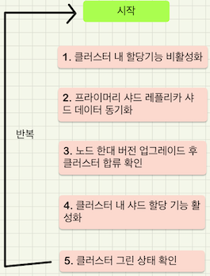

# 기초부터 다지는 ElasticSearch 운영노하우

## 6장 클러스터 운영하기
- ES 클러스터 구축후 안정적으로 운영하기 위한 내용들
- ES 버전 업
- 인덱스의 샤드 배치 방식 변경
- 운영 중 온라인으로 클러스터 / 인덱스 설정 변경
- 인덱스 API 활용
- 템플릿 활용

### ES 버전 업
- ES 의 버전 업그레이드 방법은 두가지
  
`ES 버전업 방식`

| 옵션 | 설명 |
| --- | --- |
| Full Cluster Restart | 전체 노드를 동시에 재시작하는 방식, 다운 타임이 발생하지만 빠른 수행시간이 특징 |
| Rolling Restart | 노드를 순차적으로 한대씩 재시작하는 방식, 다운 타임은 없지만 노드 개수에 따라 소요 시간이 길어질 수 있음 |

`Rolling Restart scenario`

| 대상 버전 | 최신 버전 (7.8.0 기준) 업그레이드 방법 |
| --- | --- |
| 5.0 ~ 5.5 | 1. v5.6 Rolling Restart Upgrade<br/>  2. v6.8 Rolling Restart Upgrade<br/> 3. v7.8.0 Rolling Restart Upgrade |
| 5.6 | 1. v6.8 Rolling Restart Upgrade<br/> 2. v7.8.0 Rolling Restart Upgrade<br/> |
| 6.0 ~ 6.7 | 1. v6.8 Rolling Restart Upgrade<br/> 2. v7.8.0 Rolling Restart Upgrade<br/> |
| 6.8 | 1. v7.8.0 Rolling Restart Upgrade  |
| 7.0 ~ 7.7 | 1. v7.8.0 Rolling Restart Upgrade |

`Full Cluster Restart Flow`



- 위 Flow 로 진행하는 이유..
  - ES 는 고 가용성을 위해 레플리캬 샤드를 생성할 수 있다.
  - 하지만 버전 업그레이드는 장애 상황이 아닌 의도적인 상황이기 때문에 샤드를 재분배 해서는 안됨

`1. 클러스터 내 샤드 할당 기능 비활성화 하기`
```shell
curl -XPUT -H 'ContentType: application/json' http://localhost:9200/_cluster/settings?pretty -d '
{
    "persistent": {
        "cluster.routing.allocation.enable": "none"
    }
}
'
```
- cluster.routing.allocation.enable
  - 클러스터 내 샤드 할당과 관련된 설정
  - "none" 으로 지정하여 샤드를 재분배 하지 않도록 한다.

`2. 프라이머리 샤드와 레플리카 샤드의 데이터 동기화`
```shell
curl -XPOST -H 'Content-Type: application/json' http://localhost:9200/_flush/synced?pretty -d
```
- 데이터 정합성을 위해 프라이머리 샤드와 레플리카 샤드의 데이터 싱크를 맞춰야 한다.

`3. 노드 한 대를 버전 업그레이드 이후 기존 클러스터 합류 확인`
```shell
sudo systemctl stop elasticsearch.service
sudo rm -Uvh ./elasticsearch-6.6.1.rpm
sudo systemctl start elasticsearch.service
```
- 작업이 완료되면 클러스터에 노드가 다시 합류한다.
> 클러스터 내 샤드 할당 기능을 **비활성화** 해두었기 때문에, 버전 업그레이드 후 클러스터에 합류하더라도 노드는 unassinged 상태의 샤드를 분배받지 못한다.
> 하지만 실제로는 해당 노드들을 가지고 있는 상태... (HEAD 툴에서 감지를 못하고 있는것 뿐.. 실제 물리적인 데이터는 이놈이 가지고 있다.)

`4. 클러스터 내 샤드 할당 기능 활성화`
```shell
curl -XPUT -H 'ContentType: application/json' http://localhost:9200/_cluster/settings?pretty -d '
{
    "persistent": {
        "cluster.routing.allocation.enable": null
    }
}
'
```
- 옵션을 null 로 지정하면, 해당 옵션이 초기화 되며, "persistent" 옵션을 지정했었기 때문에 기본 값으로 초기화 된다.
  - 기본 값은 "all"
> 이 작업 이후 unassigned 상태의 샤드를 할당 받고 HEAD 툴에서 정상적으로 샤드 배치가 된 모습을 확인할 수 있다.

### 샤드 배치 방식 변경
- 대부분의 경우 자동으로 샤드를 재 배치를 수행한다.
- 하지만 특정한 상황에서는 샤드 배치 방식을 변경해 주어야한다.
  - 특정 노드 노드에 장애가 발생 해서 unassinged 샤드에 대한 재 배치 작업이 5회 이상 실패
  - 오래된 인덱스의 샤드를 특정 노드에 강제로 재배치

| 옵션 | 설명 |
| --- | --- |
| reroute | 샤드 하나하나를 특정 노드에 배치시 |
| allocation | 클러스터 전체에 해당하는 샤드 **배치** 방식 변경시 |
| rebalance | 클러스터 전체에 해당하는 샤드 **재분배** 방식 변경시 |
| filtering | 특정 조건에 해당하는 샤드를 특정 노드에 배치시 |

