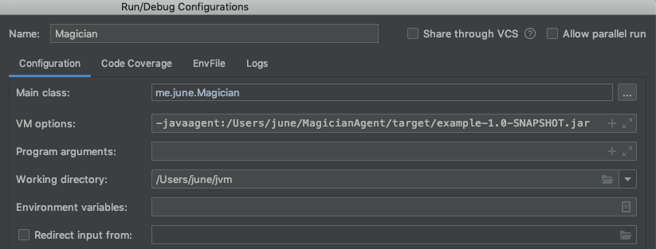

# 더 자바 코드를 조작하는 방법 - javaagent
- 기존에는 ByteBuddy를 사용해서 전처리를 해준뒤, 다시 실행해야지만 모자에서 토끼가 나오는 마술이 일어난다.
    - ByteBuddy로 바이트코드 조작을 하는 시점에 이미 Hat클래스를 로드 했기때문에, ByteBuddy로 바이트조작을 한다 한들, 실행라인에서 새로이 클래스를 로드하지 않기때문에 발생하는 일이다.
- 하지만 이런경우는 우리가 바라는 그림이 아니다.
- 우리가 바라는 그림은 현재 마술사 클래스에서 아무런 전처리작업 없이 실행만 하여도 모자에서 토끼가 나오는 마술이 펼쳐지는 것이다.

#### JavaAgent

`소개`
- JDK는 JVM이 구동될때 이 JVM내에서 특정 작업을 수행할 에이전트, 즉 요원을 지정할 수 있는 방식을 제공해왔다.
- JDK1.5 이전 버전에서는 JVMPI(JVM Profiler Interface) 라고 불렀다.
- JDK1.5 부터는 JVMTI(JVM Tool Interface)라는 새로운 인터페이스가 제공된다.


우리는 javaagent방식을 이용하여 우리가 원하는 그림을 그릴것이다.

`MagicianAgent`
ByteBuddy를 이용한 작업을 처리할 MagicianAgent를 구현하자.

구현하기에 앞서 새로운 프로젝트를 생성후, pom.xml에 ByteBuddy 의존성을 추가해준다.
```xml
<dependency>
    <groupId>net.bytebuddy</groupId>
    <artifactId>byte-buddy</artifactId>
    <version>1.10.1</version>
</dependency>
```

다음은 MagicianAgent 클래스이다.
- agent클래스는 premain이라는 메소드를 재정의 해주어야한다.
- Instrumentation을 사용해서 조작하는 것을 사용한다.
- 이를 구현할때 ByteBuddy 혹은 ASM등을 사용 할 수 있는 것이다.
```java
public class MagicianAgent {

    public static void premain(String agentArgs, Instrumentation inst) {
        new AgentBuilder.Default() // 기본 빌더를 생성한다.
                .type(ElementMatchers.any()) // 아무런 타입을 가지고 변경을 시도한다.
                .transform(new AgentBuilder.Transformer() {
                    @Override
                    public DynamicType.Builder<?> transform(DynamicType.Builder<?> builder, TypeDescription typeDescription, ClassLoader classLoader, JavaModule javaModule) {
                        return builder.method(named("pullOut")).intercept(FixedValue.value("Rabbit")); // 이전과 마찬가지로 pullOut메소드를 가로채 Rabbit이라는 고정 값을 반환하도록 변경한다.
                    }
                }).installOn(inst); // 변경사항을 Instrumentation에 적용한다.
    }
}
```

agent 구현이 완료되었는데, 이를 JAR로 패키징하며 특별한 값들을 넣어주어야한다.
JAR로 패키징할떄 매니패스트를 조작할수 있는 maven 플러그인을 사용해야한다.

`Maven jar plugin manifest`
- mainfastEntries 내부에 특정 값들을 설정해 주어야한다.
    - Premain: 자바 실행시 옵션으로 주어 실행
    - Agent: 프로세스가 이미 실행중일때 거기에 프로세스를 합치는 방식

Redefine, Retransform 설정도 true로 적용해준다.
```xml
<build>
<plugins>
    <plugin>
    <groupId>org.apache.maven.plugins</groupId>
    <artifactId>maven-jar-plugin</artifactId>
    <version>3.1.2</version>
    <configuration>
        <archive>
        <index>true</index>
        <manifest>
            <addClasspath>true</addClasspath>
        </manifest>
        <manifestEntries>
            <mode>development</mode>
            <url>${project.url}</url>
            <key>value</key>
            <Premain-Class>me.june.MagicianAgent</Premain-Class>
            <Can-Redefine-Classes>true</Can-Redefine-Classes>
            <Can-Retransform-Classes>true</Can-Retransform-Classes>
        </manifestEntries>
        </archive>
    </configuration>
    </plugin>
</plugins>
</build>
```

설정이 완료 되었다면 메이븐을 이용해 패키징을 진행한다.
```
mvn clean package
```

패키징이 완료된 JAR파일내에 존재하는 MANIFEST파일의 내용은 다음과 같다.


MANIFEST 헤더정보에 PremainClass, Redefine, Retransform과 같은 정보가 들어가는것이 확인된다.


#### Agent 적용하기

다시 기존 프로젝트로 돌아와 VM Option으로 javaagent옵션을 걸어준뒤 실행한다.




`실행결과`


