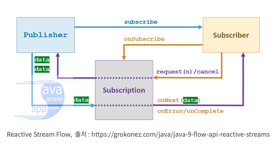

# Spring 5 in Action

## 10장 리액터 개요
- 애플리케이션 코드는 **명령형** 과 **리액티브** 두 가지 형태로 작성이 가능하다.
- **명령형** 은, 순차적으로 연속되는 작업이며, 각 작업은 한번에 하나씩 ㅣㅇ루어 진다.
- **리액티브** 는 데이터 처리를 위한 일련의 작업들이 정의되지만, 병렬로 실행될 수 있다.

### 리액티브 프로그래밍의 이해
- 리액티브 프로그래밍은 명령형 프로그래밍의 대안이 되는 패러다임
- *명령형의 한계를 해결할 수 있다.*
- 리액티브 프로그래밍은 본질적으로 **함수적** 이며, **선언적** 이다.
- 작업 단계를 나타내는 것이 아닌, **데이터가 흘러가는 파이프라임 혹은 스트림을 포함** 한다.
    - 데이터의 흐름을 기술한다 라는 느낌..

### 리액티브 스트림
- 리액티브 스트림은 넷플릭스, 라이트밴드, 피보탈 의 엔지니어에 의해 2013년에 시작되었다.
- 이는 **차단되지 않는 백 프레셔 (backpressure)** 를 갖는 비동기 스트림 처리의 표준을 제공하는 것이 목적이다.
- JDK 1.9 에 포함되어 있다. java.util.concurrent.Flow
- http://www.reactive-streams.org/

#### 자바 스트림과 리액티브 스트림
- 이 둘은 많은 유사성이 있다.
- Streams 라는 단어가 들어가며, 다수의 같은 오퍼레이션을 공유한다.
- 하지만 자바 스트림은 대개 동기화 되어있고, 한정된 작업을 수행한다.
- 리액티브 스트림은 무한 데이터 셋을 비롯해 어떤 크기의 데이터 셋이건 비동기 처리를 지원하며, 실시간 데이터 처리 및 **백 프레셔** 를 사용해 데이터 전달 폭주를 막는다.

#### 백프레셔 (backpressure)
- 컴포넌트가 대처할 수 없고, 장애가 발생해선 안되기 때문에 컴포넌트는 상위 컴포넌트들에게 자신이 과부화 상태임을 알려 주어야한다.
- backpressure 는 시스템 부하로 인해 무너지지 않고 정상적인 응답을 할 수 있게 하는 **피드백 방법**
- 사용자에게 전달되어 응답성이 떨어질 수 있지만, 부하에 대한 시스템 복원력을 보장한다.


#### 구성요소
1. Publisher (발행자)
2. Subscriber (구독자)
3. Subscription (구독)
4. Processor (프로세서)

- Publisher 는 데이터를 **생산** 하고, 데이터를 **Subscriber** 가 **Subscription** 하는 구조로 이다.


`Publisher`
```java
public interface Publisher<T> {
    void subscribe(Subscriber<? super T> var1);
}
```
- 구독자를 받아들이는 subscribe 메소드가 존재한다.
- Subscriber 가 구독신청이 되면, Publisher 로 부터 이베느를 수신할 수 있으며, Subscriber 인터페이스의 메소드를 통해 전송된다.

`Subscriber`
```java
public interface Subscriber<T> {
    void onSubscribe(Subscription var1);

    void onNext(T var1);

    void onError(Throwable var1);

    void onComplete();
}
```
- Publisher 는 onSubscribe 를 호출해 첫 이벤트를 송신한다.
- onSubscribe 메소드 의 인자로 Subscription 객체를 받으며, 이를 통해 구독자는 구독을 관리할 수 있다.

`Subscription`
```java
public interface Subscription {
    void request(long var1);

    void cancel();
}
```
- 구독자는 Subscription 의 request 를 호출해서 데이터를 요청, cancel() 를 호출해 구독을 취소한다.
- request 메소드를 보면 long 타입의 인자가 존재하는데 받고자 하는 데이터 항목수를 의미한다. 
- 이것이 **백 프레셔** 이다.

`Processor`
```java
public interface Processor<T, R> extends Subscriber<T>, Publisher<R> {
}
```
- Processor 는 Subscriber 와 Publisher 를 합친 인터페이스 이다.

> JDK 와 io.reactivestreams 간의 호환을 위해 FlowAdapters 클래스를 제공한다.

`Reactive-Streams Flow`



### 리액터 시작하기
- 리액티브 프로그래밍은 명령형 프로그래밍과 다른 방식으로 접근해야 한다.
- 작업 단계를 기술하는 것이 아닌, **데이터의 흐름을 기술하는것** 이다.

`명령형 코드`
```java
String name = "ncucu";
String capitalName = name.toUpperCase();
String greeting = "Hello, " + capitalName + "!";
System.out.println(greeting);
```

`리액티브 코드`
```java
Mono.just("ncucu")
    .map(n -> n.toUpperCase())
    .map(cn -> "Hello, " + cn + "!")
    .subscribe(System.out::println);
```

#### Flux 와 Mono
- **Mono** 는 0-1 개의 결과를 처리하기 위한 객체
- **Flux** 는 0-N 개의 결과를 처리하기 위한 객체

> 여러 스트림을 하나의 결과로 모을때 Mono 를 사용하고, Mono 들을 합쳐 여러 개의 값을 처리할때 Flux 를 사용한다.
> 위 둘은 Publisher 인터페이스의 구현체이다.