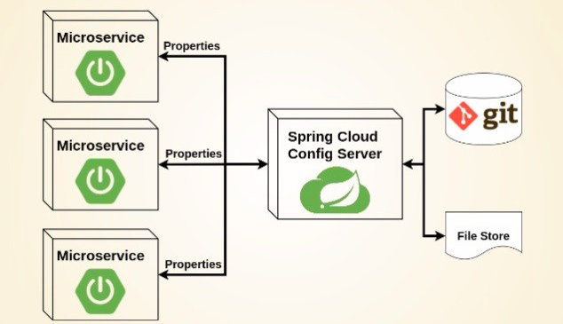
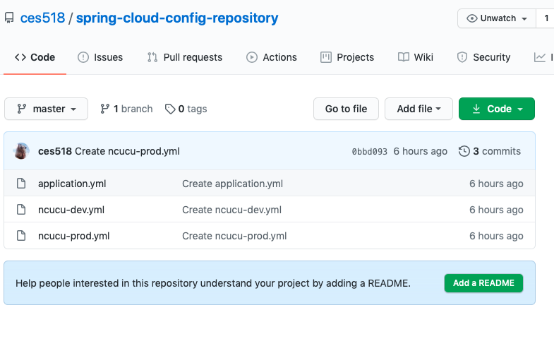

# Spring 5 in Action

## 14장 클라우드 구성 관리
- 모놀리틱 아키텍쳐를 채용한 작은 규모의 애플리케이션인 경우 큰 문제가 되는 경우는 적지만
- 마이크로서비스 아키텍쳐를 채용한 대규모 애플리케이션의 경우 여러 마이크서비스에 걸쳐 중복적인 속성들이 적용되므로 문제가 될 수 있다.
  - 각 서비스간의 설정 싱크가 맞지 않는등 ..
- 이런 문제를 해결하기위해 스프링 클라우드의 구성 서버를 사용하면 모든 마이크로서비스에 대해 중앙 집중식 구성을 제공할 수 있다.

### 구성 공유하기
- 구성속성이 런타임 환경을 변경하거나, 런타임 환경에 고유한 것이어야 한다면, 자바 시스템 속성이나 OS 환경 변수를 사용하는것이 좋음
- 값이 변경될 가능성이 거의 없고, 애플리케이션에 특정되는 속성은 yaml, properties 파일로 배포되는것이 좋다.

> 간단한 경우에는 문제가 되지 않지만, 시스템 속성 혹은 OS 환경 변수에 설정하는 경우 속성이 변경될때마다 애플리케이션이 재시작 되어야 한다.
> 구성속성을 위해 재배포하거나 재시작 한다는 것은 매우 불편하며, 최악의 경우 애플리케이션에 결함이 생길 수 있다.

#### 중앙 집중식 구성 관리
- 구성이 애플리케이션 코드에 패키징되어 배포되지 않는다.
- 애플리케이션을 다시 빌드하거나 배포하지 않고 구성을 변경하거나 원래 값으로 환원할 수 있다.
- 애플리케이션 재시작없이도 런타임에 구성 속성을 변경할 수 있다.
- 공통적인 구성을 공유하는 경우 각 서비스가 별개로 유지.관리를 하지 않아도 된다.
- 보안에 민감한 속성은 애플리케이션 코드와 별개로 암호화 하여 유지.관리 할 수 있다.

### Spring Cloud Config



- 스프링 클라우드 구성서버는 파일, 깃, 볼트와 같은 것들을 백엔드로 사용해서 구성 속성을 제공 한다.

### 구성서버 활성화 하기
- 구성 서버는 별개의 애플리케이션으로 개발되어 배포된다.
- 스프링 클라우드 구성서버를 사용하려면 spring-cloud-config-server 의존성을 추가해 주어야 한다.

`pom.xml`
```xml
<dependency>
    <groupId>org.springframework.cloud</groupId>
    <artifactId>spring-cloud-starter-config</artifactId>
</dependency>
```

`Application.java`
```java
@SpringBootApplication
@EnableConfigServer
public class Application {

	public static void main(String[] args) {
		SpringApplication.run(Application.class, args);
	}

}
```
- @EnableConfigServer 애노테이션을 사용해서 구성 서버를 활성화 하여 자동 구성되도록 한다.

### 구성서버 연동 - Git
- 구성서버에 한가지 더 추가할것이 있다.
- 구성 서버가 처리할 속성들이 있는곳 (구성 리포지토리) 를 지정해 주어야한다.
- 우리는 Git Repository 인 Github 를 사용할 것이다.

`application.yaml`
```yaml
server.port: 8888
spring:
  cloud:
    config:
      server:
        git:
          uri: https://github.com/ces518/spring-cloud-config-repository
```
- 서버 포트를 8888로 지정한 이유는, 구성 서버의 클라이언트가 구성서버로 부터 구성 데이터를 가져올때 사용하는 기본 포트가 8888 이기 때문이다.
- 또한 config server 로 github 저장소 uri 를 지정해 주었다.
  - 별도의 깃 저장소를 만들어야 한다.
  - 저장소의 root 에 application.yaml 을 만들어 두어야한다.

`spring cloud config repository`



- 애플리케이션을 실행하고 다음과 같은 로그가 보인다면 연동에 성공한것


- curl localhost:8888/application/default 로 요청을 보내면 다음과 같이 구성속성에 대한 응답이 온다.

```shell
curl localhost:8888/application/default
{"name":"application","profiles":["default"],"label":null,"version":"0bbd093c8b9ab3dc5a3781e8a8131f810201a67b","state":null,"propertySour june@bagjun-yeong-ui-MacBook-Pro  ~ 
```

- 스프링 클라우드 구성서버를 구성하면 다음과 같은 엔드포인트가 생성된다.
  - http://{host}/{spring.application.name}/{profile}/{git-branch}
  - master branch 인 경우 생략이 가능하다.
  - 우리가 요청했던 URI 를 대입해본다면, 8888 로컬 구성서버에, application 으로 지정된 애플리케이션의 default 프로파일 구성을 조회한것이다.
