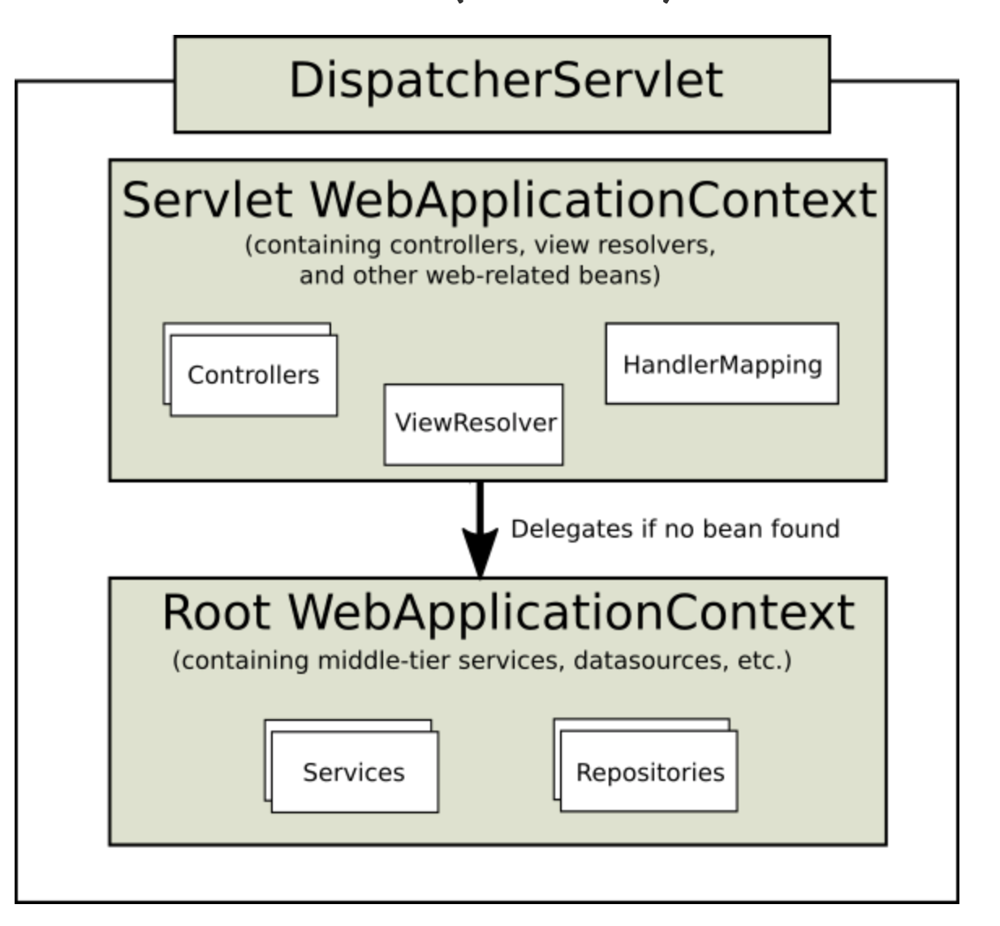

# Spring 5 in Action

## 1장 스프링 애플리케이션 초기 설정

### 스프링이란 ?
- 스프링은 **애플리케이션 컨텍스트 (Application Context)** 라는 **컨테이너 (Container)** 를 제공한다.
- 이 컨텍스트는 애플리케이션 내에서 사용되는 컴포넌트들을 생성하고 관리한다.
- 애플리케이션 컨텍스트가 관리하는 컴포넌트 들은 **빈 (Bean)** 이라고 불린다.
- 빈의 상호 연결은 **의존성 주입 (Dependency Injection)** 패턴을 기반으로 수행된다.
- 애플리케이션에서 사용하는 컴포넌트의 생성 과 관리를 스프링이 처리한다.
- 예전에는 XML 기반의 설정을 많이 사용하였지만, 요즘에는 자바기반 구성이 더 많이 사용된다.

`Spring의 기본 구조`

- 위 사진은 조금 예전에 주로 많이 구성하던 컨텍스트의 모습이다.
- 요즘에는 RootContext 를 생략하고, 단일 ApplicationContext 하나로 많이 구성을 한다.

`자바 기반 설정 예시`
```java
@Configuration
class HelloConfig {
    
    @Bean
    public HelloService helloService() {
        return new HelloService();
    }
}
```
- **@Configuration** 애노테이션을 사용해 설정 클래스임을 스프링에게 알려준다.
- **@Bean** 애노테이션을 사용해서 스프링이 관리하는 컴포넌트로 등록할 수 있다.
- 비슷한 역할을 하는 애노테이션으로 **@Component** 애노테이션이 있다.
- 이 두 애노테이션의 역할은 유사하며, 각자 사용하는 용도가 다르다.
- 우선 두 애노테이션의 선언을 살펴보면 다음과 같다.

`@Bean`
```java
@Target({ElementType.METHOD, ElementType.ANNOTATION_TYPE})
@Retention(RetentionPolicy.RUNTIME)
@Documented
public @interface Bean {
    // ....
}
```

`@Component`
```java
@Target(ElementType.TYPE)
@Retention(RetentionPolicy.RUNTIME)
@Documented
@Indexed
public @interface Component {
    // ....
}
```

- 선언 부분을 살펴보면, 각자 선언할 수 있는 타입이 정해져있어 있다.
- @Component 는 직접 작성한 클래스 상단에 선언하여 컴포넌트로 등록할때 사용한다.
- @Bean 직접 작성하지 않은 클래스 (외부 라이브러리) 를 컴포넌트로 등록할때 사용한다.
- 하지만 이는 **절대적인 규칙은 아니다.**
- 만약 특정 Config 클래스 하나만 Import 했을때 관련된 여러 컴포넌트들을 일괄적으로 설정해야 하는 경우 @Bean 을 사용해야 한다.

### 스프링 부트
- **스프링 부트 (Spring Boot)** 는 스프링의 생산성 향상을 제공한다.
- 스프링 != 스프링부트 라고 생각하는 사람들이 의외로 많은데, 스프링 부트도 스프링이다.
- 스프링 부트는 여러 자동설정 기능들을 제공하며, 이로 인해 많은 설정 작업들이 줄어든다.
- 또 다른 강점은 바로 **의존성 관리** 이다.
- 개발을 진행하면서 어쩌면 많은 시간을 잡아먹는, 또는 시간낭비가 될 수 있는 라이브러리 간의 버전 호환 (의존성 관리)를 부트가 해준다.
- 의존성 관리의 핵심은 **spring-boot-starter-parent**

`spring boot의 의존성 버전관리`
```xml
 <properties>
    <activemq.version>5.15.11</activemq.version>
    <antlr2.version>2.7.7</antlr2.version>
    <appengine-sdk.version>1.9.78</appengine-sdk.version>
    <artemis.version>2.10.1</artemis.version>
    <aspectj.version>1.9.5</aspectj.version>
    <assertj.version>3.13.2</assertj.version>
    <atomikos.version>4.0.6</atomikos.version>
    <awaitility.version>4.0.2</awaitility.version>
    <bitronix.version>2.1.4</bitronix.version>
    <build-helper-maven-plugin.version>3.0.0</build-helper-maven-plugin.version>
    <byte-buddy.version>1.10.8</byte-buddy.version>
    <caffeine.version>2.8.1</caffeine.version>
    <cassandra-driver.version>3.7.2</cassandra-driver.version>
    <classmate.version>1.5.1</classmate.version>
    <commons-codec.version>1.13</commons-codec.version>
    <commons-dbcp2.version>2.7.0</commons-dbcp2.version>
    <commons-lang3.version>3.9</commons-lang3.version>
    <commons-pool.version>1.6</commons-pool.version>
    <commons-pool2.version>2.7.0</commons-pool2.version>
    <couchbase-cache-client.version>2.1.0</couchbase-cache-client.version>
    <couchbase-client.version>2.7.12</couchbase-client.version>
    <db2-jdbc.version>11.5.0.0</db2-jdbc.version>
    <dependency-management-plugin.version>1.0.9.RELEASE</dependency-management-plugin.version>
    <derby.version>10.14.2.0</derby.version>
    <dropwizard-metrics.version>4.1.3</dropwizard-metrics.version>
    <ehcache.version>2.10.6</ehcache.version>
    <ehcache3.version>3.8.1</ehcache3.version>
    <elasticsearch.version>6.8.6</elasticsearch.version>    
</properties>
```

- 스프링 부트의 부트스트랩은 기존의 Tomcat 과 같은 WAS 가 아닌, Java Class 로 부터 시작된다.

`부트스트랩 클래스`
```java
@SpringBootApplication
class HelloApplication {
    public static void main(String[] args) {
        SpringApplication.run(HelloApplication.class, args);
    }
}
```
- **@SpringBootApplication** 을 사용해 메인 클래스임을 명시해준다.
- @SpringBootApplication 은 아래의 3개 애노테이션을 합성한, 메타애노테이션이다.
- @SpringBootConfiguration : 현재 클래스를 구성 클래스로 지정한다. @Configuration 보다 좀 더 특화된 형태이다.
    - 단위 테스트 혹은 통합 테스트시 유효하다. 테스트 애노테이션 사용시 이 애노테이션을 찾는다.
- @EnableAutoConfiguration : 스프링 부트의 자동 설정을 활성화 한다. 핵심은 **spring.factories** 
- @ComponentScan : 컴포넌트 검색을 활성화 한다.

### 스프링 부트 테스트
- 스프링 부트 테스트 클래스는 매우 간단하다.
- **@SpringBootTest** 애노테이션 하나만 지정하면, @SpringBootApplication 애노테이션이 선언된 클래스를 찾아 빈 설정을 해주어 테스트 환경 조성이 된다.
- spring-boot-starter-test 의존성이 추가되어 있어야 한다.

`SpringBoot Test`
```java
@SpringBootTest
class HelloApplicationTests {

    @Test
    void contextLoads() {

    }
}
```

### 스프링 부트 Thymeleaf
- 기존 Spring 을 사용하던 개발자라면 JSP 가 익숙할 것이다.
- 하지만 스프링 부트 에서 JSP 를 사용하려면, 몇 가지 추가적인 설정이 필요하고, 권장하지 않는다.
- 스프링부트에서 공식 지원하는 Thymeleaf 라는 뷰 템플릿을 사용하자.
- https://www.thymeleaf.org

### 스프링 부트 DevTools
- DevTools 는 개발자에게 편리한 도구를 제공한다.
1. 코드가 변경되면, 자동으로 애플리케이션을 재실행 시킨다.
    - 이는 직접 재시작 보다 빠르다.
    - 스프링 부트는 클래스로더를 2개 사용한다.
    - BaseClassLoader (의존성을 읽어들인다.)
    - RestartClassLoader (애플리케이션 코드를 읽어들인다.)
2. 브라우저로 전송되는 리소스가 변경될 때 자동으로 브라우저를 리프래시한다.
3. 템플릿 캐시를 자동으로 비활성화 한다.
4. H2 DB 를 사용중이라면, H2 콘솔을 활성화 한다.

### 스프링 데이터
- 간단한 자바 인터페이스로 애플리케이션의 데이터 리포지토리를 정의할 수 있는 기능을 제공한다.
- JPA, Mongo, Neo4j 등 서로 다른 데이터베이스와 함께 사용될 수 있다.

### 스프링 시큐리티
- 인증, 허가, API 보안 등 시큐리티를 사용하는 것만으로도 개발자가 신경써야할, 놓칠수 있는 각종 보안적인 문제의 대부분이 해결된다.

### 정리
- **개발자에게 봄이 온다.** 를 실현시켜주는 것이 스프링의 목표이다.
- 스프링 부트는 손쉬운 의존성 관리, 자동 설정 등 스프링을 이용한 애플리케이션 개발시 편리한 기능을 제공한다.

## 참고
- https://stackoverflow.com/questions/10604298/spring-component-versus-bean
- https://jojoldu.tistory.com/27