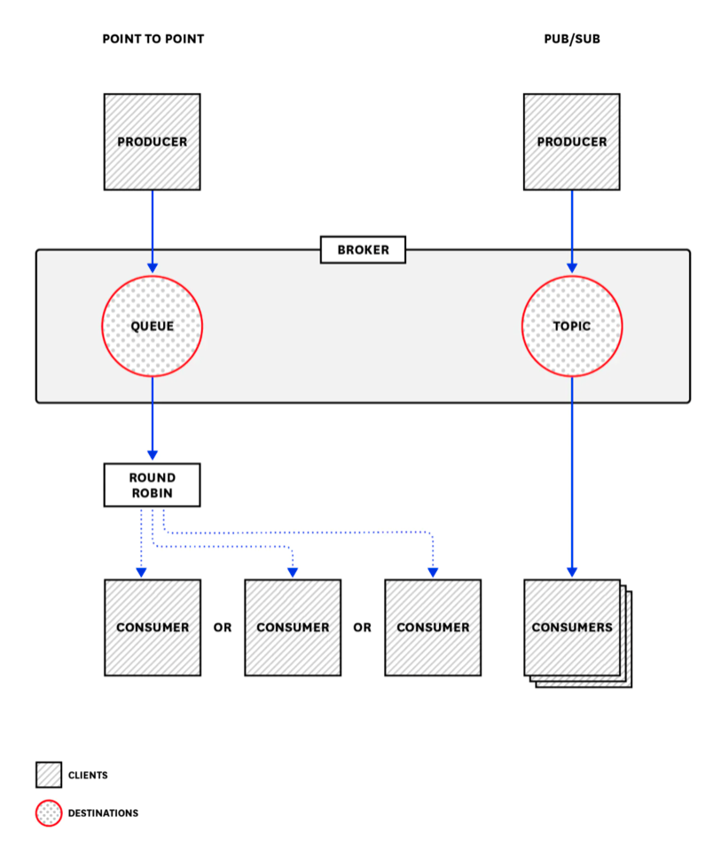
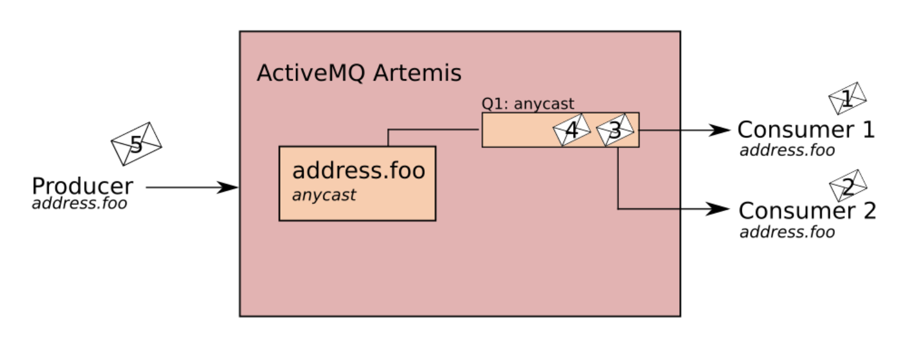
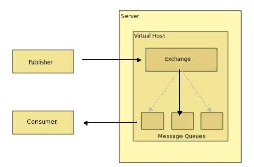
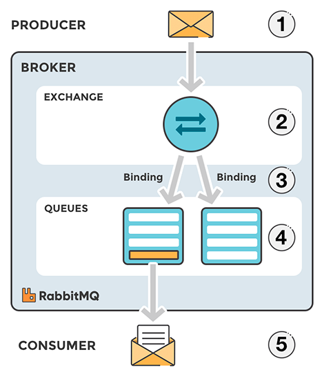
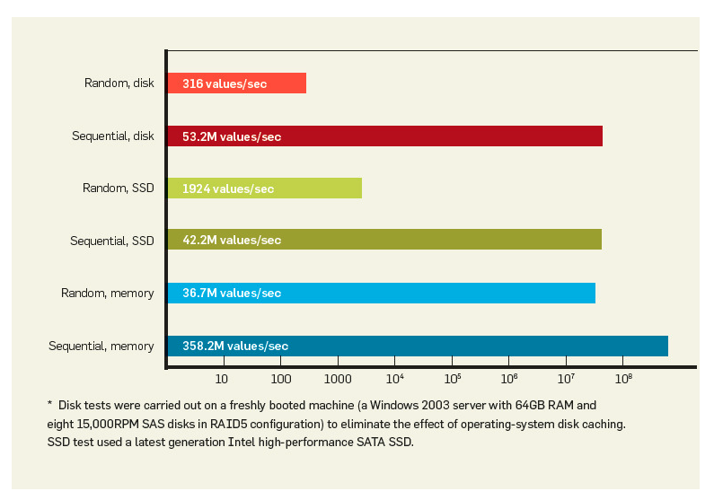
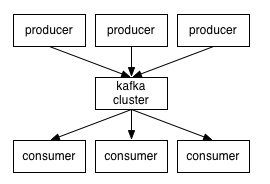
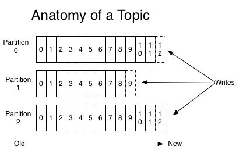

# Spring 5 in Action

## 8장 비동기 메시지 전송하기
- **비동기 (asynchronous)** 메시징은 애플리케이션간 응답을 대기하지 않고 간접적으로 메시지를 전송하는 방법
- 이는 애플리케이션의 결합도를 낮추고, 확장성을 높혀준다.
- 스프링이 제공하는 3가지 비동기 메시지가 있다.
1. JMS (Java Message Service)
2. RabbitMQ (AMQP, Advanced Message Queueing Protocol) 
3. Kafka (Apache Kafka)

### Blocking 과 NonBlocking, Synchronous 와 Asynchronous
- 차이를 설명할수 있나요 ?
- Blocking 과 NonBlocking 는 함수의 **제어권** 과 관련이 있다.
  - 이는 주로 I/O 를 예로 많이 든다.
  - 대표적으로는 JDBC.. 커넥션풀을 많이 주더라도 JDBC 는 Blocking 방식으로 동작하기 때문에, 동시에 처리가능한 것은 CPU 코어수를 넘지 못한다.
- Synchronous 와 Asynchronous 는 추상적인 개념이다.
  - 주로 작업 단위를 예로 많이 든다.
  - 작업이 완료되면 호출된 함수가 callback 함수를 실행해 완료 여부를 알려준다면 Asynchronous
  - 메인 스레드가 주기적으로 작업이 완료됨을 확인한다면 ? Synchronous
- 뭔가 비슷하면서도 다른 느낌적인 느낌 ? ...

> Blocking-Async 의 조합은 ???.. 띠용.. 왜쓰는거지 ?
> Node-MySQL, WebFlux-RDB 조합이 이런 느낌...

- 실무에 대입해보자면....
  - 모든건 상대적인 요소
  - 비즈니스가 중요한 플랫폼적인 성향을 가진 앱 -> 상품, 주문 등.. (WebMvc-RDB)
  - 사용자에게 노출하고, 전시적인 요소가 강하고, 트래픽을 받아내야한다. (WebFlux-NoSQL)

- https://homoefficio.github.io/2017/02/19/Blocking-NonBlocking-Synchronous-Asynchronous/

### JMS

#### JMS 란?
`위키 백과`
```
자바 메시지 서비스(Java Message Service; JMS)는 자바 프로그램이 네트워크를 통해 데이터를 송수신하는 자바 API이다.

자바 메시지 서비스 API는 두 개 혹은 그 이상의 클라이언트 간 메시지 통신을 위한 자바 메시지 기반 미들웨어 API(자바 메시지 지향 미들웨어 (MOM) API)이다.
JMS는 자바 플랫폼, 엔터프라이즈 에디션에 포함되어 있으며, 자바 커뮤니티 프로세스의 **JSR 914** 로 개발된 명세서에 의해 정의된다.
자바 메시지 서비스는 자바 플랫폼, 엔터프라이즈 에디션에 기반을 둔 애플리케이션 컴포넌트들끼리 메시지를 생성, 송/수신, 읽기 기능을 제공하는 메시징 표준이다. 
분산된 애플리케이션끼리 느슨하게 연결해주고 신뢰성을 보장하며, 비동기 처리가 가능하도록 해준다.
```

> 한줄 요약 -> **JMS (Java Message Service)** 란, 자바 메시징의 표준이다.
- https://docs.oracle.com/cd/E19435-01/819-2222/concepts.html
- AWS 에서 Amazon MQ 라는 형태로 Apache ActiveMQ 를 지원한다.

#### JMS 설정
- JMS 를 사용하기 위해서는 JMS 클라이언트를 클래스패스에 추가해 주어야 한다.
- JMS 구현체는 대표적으로 **ActiveMQ** 를 사용한다. 최근에는 **ActiveMQ Artemis** (차세대 ActiveMQ) 를 사용함 
  
`ActvieMQ`
- ActiveMQ 5 가 주요 릴리즈 버전으로 사용되고 있고 6버전으로 업글중..
- JMS 1.1 구현
- ActiveMQ 6 는 ActiveMQ Apollo 라는 이름으로 비동기 논블록 아키텍쳐로 재구상중이 었다.
- ActiveMQ Apolo 는 1.x 까지 잘 진행되다가, 1.7.1 에 와서 ActiveMQ Artemis 라는 이름으로 변경되었다.



- 메시지를 **생산** 하는 Producer, **전달** 하는 Broker, **소비** 하는 Consumer 모델로 이루어져 있다.
- ActiveMQ 는 Queue 방식과 Pub/Sub 방식을 지원한다. 
- **Queue** 방식은 Consumer 들에게 하나의 메시지를 Round-Robin 방식으로 하나의 Consumer 에게 처리하도록 보내는 방식
- **Pub/Sub** 방식은 Topic 에 관심이 있는 모든 Consumer 에게 메시지가 전달된다.

`ActiveMQ Artemis`
- JMS 2.0 과 1.1 지원
- High availability -> Active/Active 지원
- Scale-out -> Clustering 지원
- High performance journal for message persistence
- **Address Model**
  
`Address Model`
- 주소, 큐, 라우팅-타입 세가지 주요 개념으로 구성된다.
- **주소** 는 메시지의 엔드포인트 이며, 주소에는 고유한 이름과 0개 이상의 큐 및 라우팅-타입 이 지정된다. 
- **큐** 는 주소와 연결되어 있으며, 주소 하나당 여러 개의 큐를 가질 수 있다.
  - 수신 메시지를 주소와 일치시키면 라우팅 유형에 따라 메시지가 큐로 전송되고, 큐를 자동 생성 및 삭제하도록 구성할 수 있다.
- **라우팅-타입** 메시지를 주소와 연결된 큐로 보내는 방법을 결정한다.
  - Point-To-Point 방식을 사용하려면 라우팅 타입을 Anycast 로 지정해야 한다.
  - 다수의 컨슈머가 존재한다면, 균등하게 분배됨 (Round-Robin 방식 사용)

`Point-To-Point`



`Pub/Sub`


- https://activemq.apache.org/components/artemis/documentation/2.0.0/address-model.html
- https://www.openlogic.com/blog/exploring-activemq-artemis
- http://people.apache.org/~clebertsuconic/


- spring-boot-starter-activemq, spring-boot-starter-artemis 를 사용하려면 각각 아래 의존성을 추가해 주어야 한다.
- 우리는 spring-boot-starter-artemis 를 사용할것...

```xml
<!-- spring-boot-starter-activemq -->
<dependency>
    <groupId>org.springframework.boot</groupId>
    <artifactId>spring-boot-starter-activemq</artifactId>
</dependency>

<!-- spring-boot-starter-artemis -->
<dependency>
    <groupId>org.springframework.boot</groupId>
    <artifactId>spring-boot-starter-artemis</artifactId>
</dependency>
```

### JmsTemplate
- JmsTemplate 은 Spring JMS 의 핵심 클래스
- 이름에서도 알수 있듯이 반복적으로 사용되는 코드를 Template 화 해둔 클래스
- spring-boot-starter-xxx 를 의존성에 추가해두면 JmsTemplate 자동설정이 된다.

`JmsTemplate`
```java
public class JmsTemplate extends JmsDestinationAccessor implements JmsOperations {

  /** Internal ResourceFactory adapter for interacting with ConnectionFactoryUtils. */
  private final JmsTemplateResourceFactory transactionalResourceFactory = new JmsTemplateResourceFactory();
  
  
  @Nullable
  private Object defaultDestination;
  
  @Nullable
  private MessageConverter messageConverter;

    // ... 
}
```

- MessageConverter 를 사용해서 메시지 변환을 시도하는데, 주의할 점은 이전에 스프링이 사용하는 HttpMessageConverter 와는 다른 인터페이스라는 점이다.

#### JmsTemplate 을 사용해 메시지 전송하기

`OrderMessageService`
```java
public interface OrderMessagingService {
    void sendOrder(Order order);
}
```

`JmsOrderMessageService`
```java
@Service
@RequiredArgsConstructor
public class JmsOrderMessagingService implements OrderMessagingService {
    private final JmsTemplate jmsTemplate;
    private final Destination orderQueue; // 도착지 큐를 빈으로 등록해두고 사용한다.

    @Override
    public void sendOrder(Order order) {
        // send 메소드를 MessageCreator 를 제공해야 한다.
        jmsTemplate.send(orderQueue, session -> session.createObjectMessage(order));

        // convertAndSend 메소드 사용 MessageCreator 를 사용하지 않아도 된다.
        jmsTemplate.convertAndSend(orderQueue, order);

        // 커스텀 헤더 메시지 추가
        jmsTemplate.send(orderQueue,
                session -> {
                    Message message = session.createObjectMessage(order);
                    message.setStringProperty("X_ORDER_SOURCE", "WEB");
                    return message;
                });

        // convertAndSend 커스텀 헤더 추가
        jmsTemplate.convertAndSend(orderQueue, order, this::addOrderSource);
    }

    private Message addOrderSource(Message message) throws JMSException {
        message.setStringProperty("X_ORDER_SOURCE", "WEB");
        return message;
    }
}
```
- 도착지 (destination) 을 지정하는 방법은 문자열 매개변수로 지정해 주거나, Destination 객체를 빈으로 등록해서 재사용 하는 방법이 있다.
- 문자열로 직접 지정해주는 경우에도 내부적으로 캐싱해서 재사용 한다.

```java
public Queue createQueue(String queueName) throws JMSException {
    if (this.sessionType == 2) {
        throw new IllegalStateException("Cannot create a queue using a TopicSession");
    } else {
        try {
            Queue queue = null;
            if (this.cacheDestination) {
                queue = (Queue)this.queueCache.get(queueName);
            }

            if (queue == null) {
                queue = this.internalCreateQueue(queueName);
            }

            if (this.cacheDestination) {
                this.queueCache.put(queueName, queue);
            }

            return queue;
        } catch (ActiveMQException var3) {
            throw JMSExceptionHelper.convertFromActiveMQException(var3);
        }
    }
}
```

`Jms Config`
```java
@Configuration
public class JmsConfig {

    @Bean
    public Destination orderQueue() {
        return new ActiveMQQueue("tacocloud.order.queue");
    }

    // Jms 의 기본 전략은 SimpleMessageConverter 를 사용한다.
    // 하지만 이는 Serializable 을 구현하기 때문에 사용하기 불편하다는 단점이 있음.
    // MappingJackson2MessageConverter 을 빈으로 등록할 경우 자동 설정에 의해 MappingJackson2MessageConverter 를 사용한다.
    // 주의할점은 Spring 의 HttpMessageConverter 와 는 다른 인터페이스 라는점... 혼동해선 안된다.
    @Bean
    public MappingJackson2MessageConverter messageConverter() {
        MappingJackson2MessageConverter messageConverter = new MappingJackson2MessageConverter();
        messageConverter.setTypeIdPropertyName("_typeId");

        Map<String, Class<?>> typeIdMappings = Map.of("order", Order.class);
        messageConverter.setTypeIdMappings(typeIdMappings);
        return messageConverter;
    }
}
```
- 앞에서 JmsTemplate 은 기본 적으로 SimpleMessageConverter 를 사용한다고 했는데. 이는 Serializable 를 구현해야 하기 때문에 사용할 때 제약사항이 있다.
  - JmsTemplate > initDefaultStrategies() 메소드
- MappingJackson2MessageConverter 를 빈으로 등록해주면 자동 설정에 의해 MappingJackson2MessageConverter 를 사용하게 되는데 이는 Serializable 구현이 필요 없다.

`Jms default destination 지정`
```yaml
spring:
  jms:
    template:
      default-destination: tacocloud.order.queue
```
- spring boot 구성 설정을 활용해서 기본 destination 을 지정해 줄 수 있다.

#### JmsTemplate 을 사용해 메시지 수신하기
- 메시지를 수신하는 방식은 크게 두가지
- **풀 모델 (pull model)** 은 메시지를 요청하고, 도착할 때 까지 대기한다.
- **푸시 모델 (push model)** 은 메시지가 수신가능하게 되면 우리 코드로 자동전달 한다.
- JmsTemplate 은 모든 메소드가 **풀 모델** 이다.

> 메시지를 요청하면 수신가능할때 까지 대기한다.
> 푸시 모델을 사용하기 위해서는 **메시지 리스너** 를 정의 해야한다.

`OrderReceiver`
```java
public interface OrderReceiver {
    Order receiveOrder();
}
```

`JmsOrderReceiver`
```java
@Slf4j
@Component
@RequiredArgsConstructor
public class JmsOrderReceiver implements OrderReceiver {
    private final JmsTemplate jmsTemplate;
    private final MessageConverter converter;
    private final Destination orderQueue;

    @Override
    public Order receiveOrder() {
        // 메시지 속성 및 헤더를 살펴볼때 유용하다.
        Message message = jmsTemplate.receive(orderQueue);
        try {
            // 응답 바디만 필요한경우 사용
            jmsTemplate.receiveAndConvert(orderQueue);
            return (Order) converter.fromMessage(message);
        } catch (JMSException e) {
            log.error(e.getMessage(), e);
            throw new RuntimeException(e);
        }
    }
}
```
- 메시지의 속성 및 헤더 정보가 필요하다면 receive 메소드를, 응답 바디만 필요한경우 receiveAndConvert 메소드를 사용하면 된다.

#### JmsMessageListener
- **@JmsListener** 애노테이션을 사용하면 메시지 리스너를 지정할 수 있다.

`OrderJmsListener`
```java
@Component
public class OrderJmsListener {

    // 특정 요청에 대한 Listener 등록
    @JmsListener(destination = "tacocloud.order.queue")
    public void receiveOrder(Order order) {
        // doSomething
    }
}
```
- 메시지 리스너는 중단없이 다수의 메시지를 처리할 수 있지만, 현재 애플리케이션 성능 및 비즈니스에 따라 적절히 선택하는것이 중요하다.

### RabbitMQ 와 AMQP

`AMQP`



- Advanced Message Queueing Protocol 의 약자라고 MQ 오픈 소스에 기반한 표준 프로토콜
- AMQP 자체는 프로토콜을 의미하며 대표적으로 RabbitMQ 를 많이 사용한다.
- AMQP 의 라우팅 모델은 세가지 요소로 구성되어 있다.
  - **Exchange**
    - Publisher 로 부터 수신한 메시지를 큐 혹은 exchange 로 분배하는 **라우터** 기능을 한다.
    - 각각의 큐나 exchange 들은 Binding 을 사용해 exchange 에 바인딩 되어 있다.
    - exchange 는 binding 에 따라 수신한 메시지들을 적절한 큐 혹은 exchange 로 라우팅 한다.
    - Binding 과 메시지를 매칭하기 위한 라우팅 알고리즘을 **Exchange Type** 이라고 한다.
    - 하나의 브로커는 여러개의 ExchangeType 을 가질 수 있다.
  - **Queue**
    - 일반적인 큐이며, consumer 에게 메시지를 전달하는 역할을 한다.
    - 큐는 관심 있는 메시지 타입을 지정한 Binding 통해 exchange 에 bind 된다.
  - **Binding**
    - exchange 와 큐와의 관계를 정의한 라우팅 테이블
    - 하나의 큐가 여러개의 Exchange 에 bind 될 수 있으며, 하나의 Exchange 가 여러개의 큐에 bind 될 수 있다.
  - **Routing Key**
    - Publisher 에서 송신한 메시지 헤더에 포함되는 가상 주소
    - Exchange 는 이것을 이용해서 어떤 큐로 메시지를 라우팅 할지 결정한다.
    - 이를 사용하지 않아도 되지만, AMQP 표준 exchange type (라우팅 알고리즘) 은 라우팅키를 이용하도록 되어 있다.
  - Standard Exchange Type
    - http://egloos.zum.com/killins/v/3025514


- https://www.cloudamqp.com/blog/2019-12-12-when-to-use-rabbitmq-or-apache-kafka.html

#### RabbitMQ 설정
- RabbitMQ 를 사용하려면 다음과 같이 spring-boot-starter-amqp 를 의존성으로 추가해 주어야한다.
- 의존성을 추가하면 JMS 와 마찬가지로 RabbitTemplate 을 포함한 자동설정이 된다. 

`pom.xml`
```xml
<dependency>
    <groupId>org.springframework.boot</groupId>
    <artifactId>spring-boot-starter-amqp</artifactId>
</dependency>
```

#### RabbitTemplate
- Spring 에서 RabbitMQ 를 지원하는 핵심 클래스이다.
- JmsTemplate 과 유사한 메소드들을 제공하지만, RabbitMQ 동작 방식에 따라 미세한 차이가 있다.
- JmsTemplate 은 지정한 큐 또는 토픽에만 메시지를 전송했다면, RabbitTemplate 은 exchange 와 Routing Key 로 메시지를 전송한다.

`RabbitTemplate`
```java
public class RabbitTemplate extends RabbitAccessor implements BeanFactoryAware, RabbitOperations, MessageListener, ListenerContainerAware, Listener, BeanNameAware, DisposableBean {
  private final StandardEvaluationContext evaluationContext = new StandardEvaluationContext();
  /// ....
}
```
- RabbitTemplate 을 살펴보면 Jms 와는 다르게 StandardEvaluationContext 를 내부적으로 가지고 있다.
  - 이말은 즉슨, SpEL 을 지원한다.
  - SpEL 에서 지원하는 기능들..
  - 
`RabbitMQOrderMessageService`
```java
@Service
@RequiredArgsConstructor
public class RabbitMQOrderMessageService implements OrderMessagingService {
    private final RabbitTemplate rabbitTemplate;

    @Override
    public void sendOrder(Order order) {
        // RabbitMQ 도 JMS 와 동일하게 MessageConverter 를 사용해서 변환을 시도한다.
        // 기본 적으로 SimpleMessageConverter 를 사용하며, Jackson2JsonMessageConverter 등을 제공한다.
        MessageConverter converter = rabbitTemplate.getMessageConverter();
        MessageProperties props = new MessageProperties();
        // Header 설정도 가능하다.
        props.setHeader("X_ORDER_SOURCE", "WEB");
        Message message = converter.toMessage(order, props);
        rabbitTemplate.send("tacocloud.order", message);
        rabbitTemplate.convertAndSend("tacocloud.order", order);

        // convertAndSend 사용시 header 설정은 MessagePostProcessor 에서 해야한다.
        rabbitTemplate.convertAndSend("tacocloud.order.queue", order, message1 -> {
            message1.getMessageProperties().setHeader("X_ORDER_SOURCE", "WEB");
            return message1;
        });
    }
}
```
- RabbitMQ 로 JMS 와 마찬가지로 MessageConverter 를 사용해서 변환을 시도하며, 기본적으로 SimpleMessageConverter 를 사용한다.
  - Jackson2JsonMessageConverter 등을 제공함..

#### RabbitMQ 메시지 수신하기
- JMS 와 마찬가지로 RabbitTemplate 을 사용한 방법과 메시지 리스너를 등록하는 방법을 제공 한다.
- RabbitTemplate 은 큐로 부터 메시지를 가져오는 **풀 모델** 기반 이고, RabbitListener 는 **푸시 모델** 기반 이다.

`RabbitOrderListener`
```java
@Component
@RequiredArgsConstructor
public class RabbitOrderReceiver {
    private final RabbitTemplate rabbitTemplate;
    private final MessageConverter messageConverter;

    // 메시지 수신은 Jms와 동일하게 풀, 푸시 방식이 존재함
    // rabbitTemplate 을 사용하는것은 pull 방식
    public Order receiveOrder() {
        // rabbitTemplate 을 사용한 수신
        Message message = rabbitTemplate.receive("tacocloud.order", 30000); // 타임아웃 지정도 가능하다.
        Order order = message != null ? (Order) messageConverter.fromMessage(message) : null;

        // receiveAndConvert 를 사용
        return rabbitTemplate.receiveAndConvert("tacocloud.order", new ParameterizedTypeReference<>(){});
    }
}
```

`RabbitListener`
```java
@Component
public class OrderRabbitListener {

    // @JmsListener 와 거의 동일하게 동작한다.
    @RabbitListener(queues = "tacocloud.order.queue")
    public void receiveOrder(Order order) {
        // doSomething
    }
}
```
- RabbitListener 또한 @JmsListener 와 거의 동일하게 동작한다.
- **RabbitListenerBeanPostProcessor** 에 대해 잠깐 얘기볼껀데...

`RabbitListenerBeanPostProcessor`
```java
public class RabbitListenerAnnotationBeanPostProcessor implements BeanPostProcessor, Ordered, BeanFactoryAware, BeanClassLoaderAware, EnvironmentAware, SmartInitializingSingleton {
  private BeanExpressionResolver resolver = new StandardBeanExpressionResolver();
  // ...
}
```

`StandardBeanExpressionResolver`
```java
public class StandardBeanExpressionResolver implements BeanExpressionResolver {
  private ExpressionParser expressionParser;

  public StandardBeanExpressionResolver() {
    this.beanExpressionParserContext = new NamelessClass_1();
    this.expressionParser = new SpelExpressionParser();
  }
  // ...
}
```

- BeanExpressionResolver 를 사용중... -> StandardBeanExpressionResolver 를 사용하고... 내부적으로 SpelExpressionParser 를 사용한다.
  - -> 그말은 ? 이놈도 SpEL 을 사용한다...
  - 이놈도 StandardEvaluationContext 를 가지고 있네 ? StandardEvaluationContext 가 뭔데 ?
- ExpressionParser 와 StandardEvaluationContext 의 차이 ?
  - StandardEvaluationContext 는 생성비용은 크지만 Field 에 대해 캐싱되고 있기 때문에 파싱이 빠르다는 점...
  - https://docs.spring.io/spring-framework/docs/3.0.0.M4/reference/html/ch06s03.html
  - https://docs.spring.io/spring-framework/docs/4.3.10.RELEASE/spring-framework-reference/html/expressions.html
  - 킹웃사이더님 의 레퍼런스 번역 -> https://blog.outsider.ne.kr/835

### 카프카
- **카프카 (Kafka)** 는 분산형 스트리밍 플랫폼 (A distributed streaming platform) 이며, **Linked In** 에서 여러 구직 채용 정보들을 한곳에서 처리하기 위해 개발이 시작 되었다.
- 대용량 실시간 로그처리에 특화 설계된 메시징 시스템이다.
- 메시지를 영속화 (파일) 하기때문에 손실 우려가 적다.
- 기존의 RabbitMQ, ActiveMQ 등은 메시지 브로커가 컨슈머에게 메시지를 PUSH 해주는 방식이었다면, 카프카는 컨슈머가 메시지 브로커로부터 직접 가져가는 PULL 방식을 채용한다.
- 이로인해 컨슈머는 최적의 성능을 낼 수 있다.

> 파일에 영속화 하는데 고성능을 낸다고 ? 이게 무슨소리
> -> 일반적으로 하드디스크의 읽기 성능은 메모리에 비해 떨어지지만, 하드디스크의 **순차적 읽기** 는 메모리에 비해 크게 떨어지지 않는다.
> 카프카의 **파일 시스템을 이용한 고성능 디자인** 에 의해 퍼포먼스를 내는것...

- 파일 시스템을 이용한 고성능 디자인 ? 대체 어떻길래...
  


- 일반적으로 하드디스크는 메모리보다 수백-수천배 이상 느리다.
- 하지만 특정 조건에서는 10배 느리거나 심지어는 빠를 수도 있다.
- ACM Queue에 게재된 The [Pathologies of Big Data](https://queue.acm.org/detail.cfm?id=1563874) 라는 글에 따르면 하드디스크의 순차적 읽기 성능은 메모리에 대한 랜덤 읽기 성능보다 뛰어나며 메모리의 순차적 읽기 성능보다 7배 정도 느리다. (물론 하드디스크의 랜덤 읽기 성능은 메모리의 랜덤 읽기 성능보다 10만배나 느리다.)
- 메모리에 캐시를 구현하지 않고 **OS 의 페이지 캐시** 에 이를 모두 위임한다.
  - OS 캐시의 원리... -> DB 서버를 재부팅하면 퍼포먼스가 떨어진다..

`Kafka 아키텍쳐`



- 카프카는 pub/sub 모델을 기반으로 동작하며, 다른 MQ 와 마찬가지로 크게 producer, consumer, broker 로 구성된다.
- Broker 는 **Topic** 을 기준으로 메시지를 관리한다.
- 전달 받은 메시지를 Topic 별로 분류하여 적재해두면, 해당 Topic 을 구독하는 Consumer 들이 메시지를 가져가 처리하는 구조이다.

#### Kafka In Depth

`Topic 과 Partition`



- Kafka 의 Topic 은 Partition 이라는 단위로 쪼개져 클러스터들의 각 서버로 분산되어 저장되며, 고 가용성을 위해 레플리카 설정을 할 경우
- 각 서버들에게 Partition 단위로 복제 되고 Partition 단위로 fail over 가 수행된다.
- 각 partition 은 0 부터 1씩 증가하는 offset 값을 메시지에 부여하며, partition 내에서 **고유식별 ID** 로 사용된다.
- topic 내에서 메시지를 식별할 때는 partition 번호 + offset 값을 이용한다.

#### 카프카 설정하기
- 카프카는 아쉽게도 spring-boot-starter 가 존재하지 않지만, spring-kafka 의존성만 추가해 준다면 자동 설정을 해준다.

`pom.xml`
```xml
<dependency>
    <groupId>org.springframework.kafka</groupId>
    <artifactId>spring-kafka</artifactId>
</dependency>
```

## 정리
- 애플리케이션 간에 비동기 메시지를 큐를 이용하 결합도를 낮추며 확장성을 높히는 구성이 가능하다.
- Spring 은 JMS, RabbitMQ, Kafka 를 지원한다.
- 모든 처리를 **동기적** 으로 할 필요는 없다.
- 대용량 트래픽 서비스라면 MQ 는 선택이 아닌 필수가 아닐까 ?...

## 참고
- https://epicdevs.com/
- http://kafka.apache.org/081/documentation.html
- https://www.microsoft.com/en-us/research/people/srikanth/?from=http%3A%2F%2Fresearch.microsoft.com%2Fen-us%2Fum%2Fpeople%2Fsrikanth%2Fnetdb11%2Fnetdb11papers%2Fnetdb11-final12.pdf
