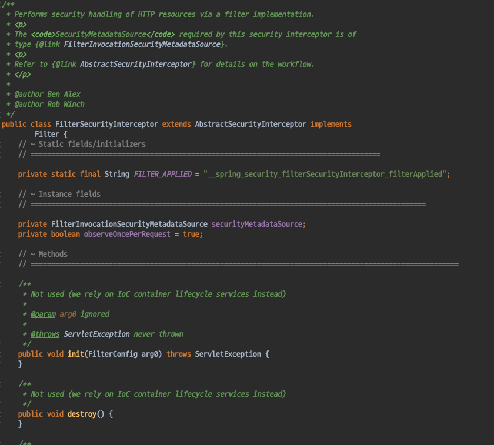
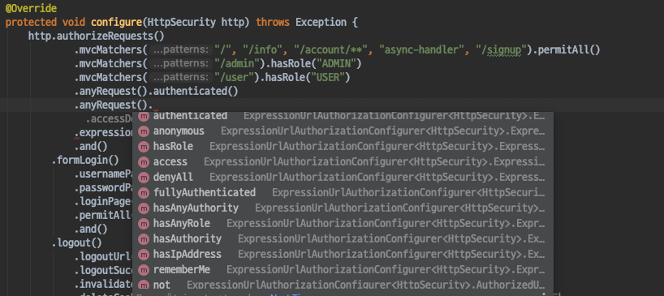

# Spring Security - FilterSecurityInterceptor

#### FilterSecurityInterceptor
- Spring Security 에서 가장 마지막에 존재하는 필터
- 아키텍쳐를 살펴볼때 이미 디버깅을 통해 디테일하게 살펴보았다.
- AccessDecisionManager등을 사용해서 인증/인가 처리를 하는 필터이다.
- SpringSecurityFilterChain의 15개의 필터 중에서 Http Resource Security 처리를 담당하는 필터이다.

##### Http Resource Security Config
- 우리가 기존에 설정해왔던 Resource관련 설정들이 바로 HttpResourceSecurityConfig이다.
- 이 설정은 AccessDecisionManager가 AccessDecisionVoter를 사용하여 인가를 처리할때 사용할 ConfigAttribute를 설정하는것이다.

- authorizeRequests()의 하위 정보를 기본으로 특정 리소스에 접근할때 필요한 권한이 있는지 확인 후 인가 처리를 하는것이다.
- 이러한 정보를 명시하는 다양한 방법이 존재한다.

인가 처리를 사용할때 사용하는 설정들을 몇가지 만 간단하게 살펴보자.

- mvcMatchers() 
    - 리소스에 대한 URL Pattern을 정의할때 SpringMvc패턴과 동일하게 설정할수 있으며 antMatcher로 리턴된다.
- antMatchers()
    - antMatchers()를 사용하여 정규 표현을 사용할 수도 있다.
- hasRole()
    - 리소스에 접근할때 필요한 사용자의 권한을 지정한다.
    - hasRole('권한명') 의 형태로 사용하는데 '권한명' 앞에 prefix로 ROLE_ 가 붙게 된다.
    - 대부분 권한을 `ROLE_ASDF` 라고 사용하기 때문에 ROLE_권한명 으로 사용한다면 hasRole을 사용할 것을 추천한다.
- hasAuthority()
    - hasRole의 하위개념이다.
    - hasRole() 을 사용하면 ROLE_ 가 prefix로 붙었지만, authority를 사용하면 ROLE_까지 지정해주어야한다.
- anonymous()
    - 익명사용자에게만 허용하는 설정이다.
    - 이는 아이러니한게 익명사용자에게만 허용되기 때문에 다른 인증된 사용자는 접근이 불가능함.
- rememberMe ()
    - rememberMe 기능으로 인증을 한 사용한 경우 허용한다.
- fullyAuthenticated()
    - rememberMe로 인증이 된 사용자는 fullyAuthenticated() 설정을 해두면 다시하면 로그인을 요구한다.
    - 중요한 URL에서 다시금 인증을 요구하는 경우라고 생각하면 된다.
- hasIpAddress()
    - 특정 아이피를 허용하는 설정이다.

#### 정리
- 지금까지 SpringSecurityFilterChain에서 사용하는 15개의 필터를 살펴보았다.
- 하지만 이 15개의 필터뿐 아니라 CORS나 RememberMe Filter등을 추가할 수 있다.
- 그외에도 커스텀한 Filter를 추가할 수도 있다.
