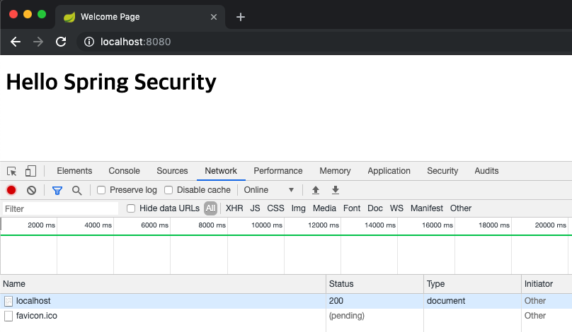
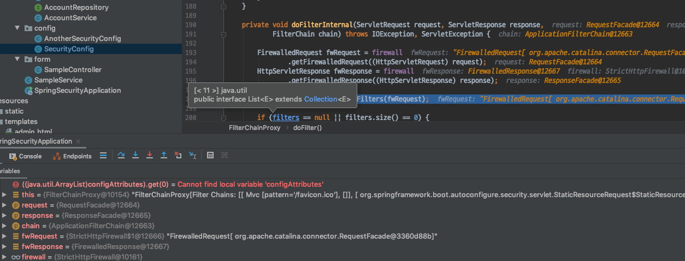

# Spring Security - WebApplicationSecurity ignore
- SpringSecurity에서 Security를 적용하고 싶지 않은 경우 설정을 방법을 살펴보자.

#### 인증이 필요한 favicon

GET localhost:8080/ 다음과 같이 루트로 요청을 보내면 
Spring Security FilterChain을 거친뒤 루트페이지에 대한 응답을 받게 된다.

하지만 이상한점은 루트페이지에 대한 응답을 받았음에도 브레이크포인트에 멈춰있고 favicon 요청에도 FilterChain을 타게된다.

우리가 기존에 했던 SpringSecurity 설정을 살펴보면 /, /info, /account/** 요청을 제외한 모든 요청들은 인증된 사용자에게 만 허용하도록 설정 하였기때문에 favicon 요청도 예외는 아닌것이다.

#### 문제점
- 현 상황에 대한 문제점은 다음과 같다.
- 우리는 /dashboard와 같은 리소스들에게만 인가를 하고싶은데 favicon을 비롯한 정적 리소스들에게도 SpringSecurity FilterChain이 적용되고 있다.
- 제대로 동작하는것처럼 보이지만 불필요한 서버자원이 낭비되고 있는것이다.

#### ignore()
- SpringSecurity에서는 Security FilterChain을 적용하고 싶지 않은 리소스에 대해 설정을 할수있도록 ignore() 를 제공한다.
- 다음과 같이 WebSecurity를 사용하는 configure Method를 Overried한뒤 ignoring() 메서드를 이용하여 Security FilterChain을 적용하고 싶지 않은 리소스들에 대한 설정을 해주면된다.
- mvcMatchers, antMatchers, requestMatchers 등 다양한 방법을 제공한다.

여기서 드는 의문은 매번 리소스가 추가될때마다 해당 리소스를 추가해주어야하는가? 이다.
만약 스프링 부트를 사용하고있다면 SpringBoot에서 제공하는 설정을 사용할 수 있다.

#### HttpSecurity
- WebSecurity설정을 하지않고, HttpSecurity설정에 정적 리소스들에 대한 ignore 설정을 해두면, SpringSecurity FilterChain을 거치게 된다.
- 결과는 동일하지만, SpringSecurity FilterChain을 거치면서 AnoymousAuthentication이 생성되고, 익명 사용자들이 접근가능한 리소스가 되는것이다.
- 불필요한 서버 자원이 낭비되는것이다.

#### 정리
- favicon과 같은 static resource들은 Spring Security FilterChain을 적용하고 싶지 않다면 WebSecurity를 커스터마이징을 해주어야한다.
- WebSecurity를 커스터마이징 하는 방법은 WebSecurityConfigurerAdapter클래스를 상속받은 설정클래스에서 configurer method를 오버라이딩 하는것이 편리하다.
- WebSecurity를 커스터마이징할때 SpringBoot를 사용중이라면 좀 더 편리한 설정이 가능해진다.
- 정적 리소스라면, HttpSecurity보다 WebSecurity에 ignore 설정을 하는것이 좀 더 효율적이고 추천하는 방법이다.
