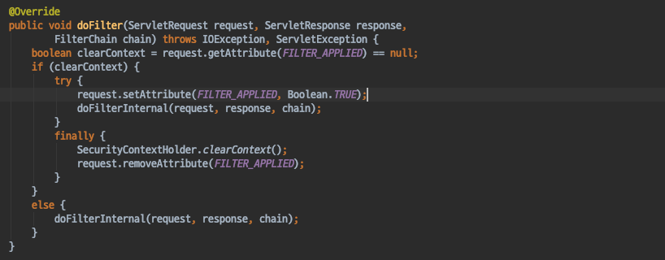
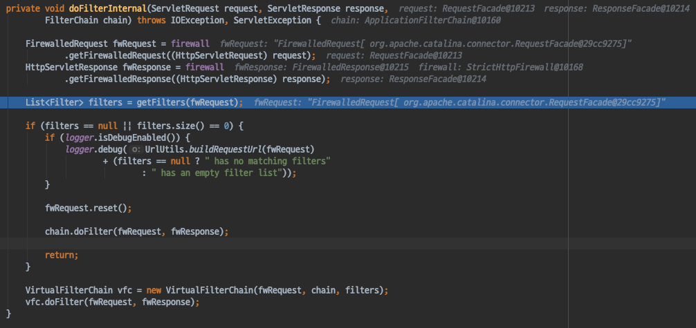
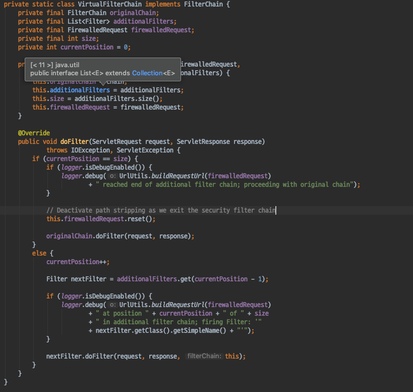
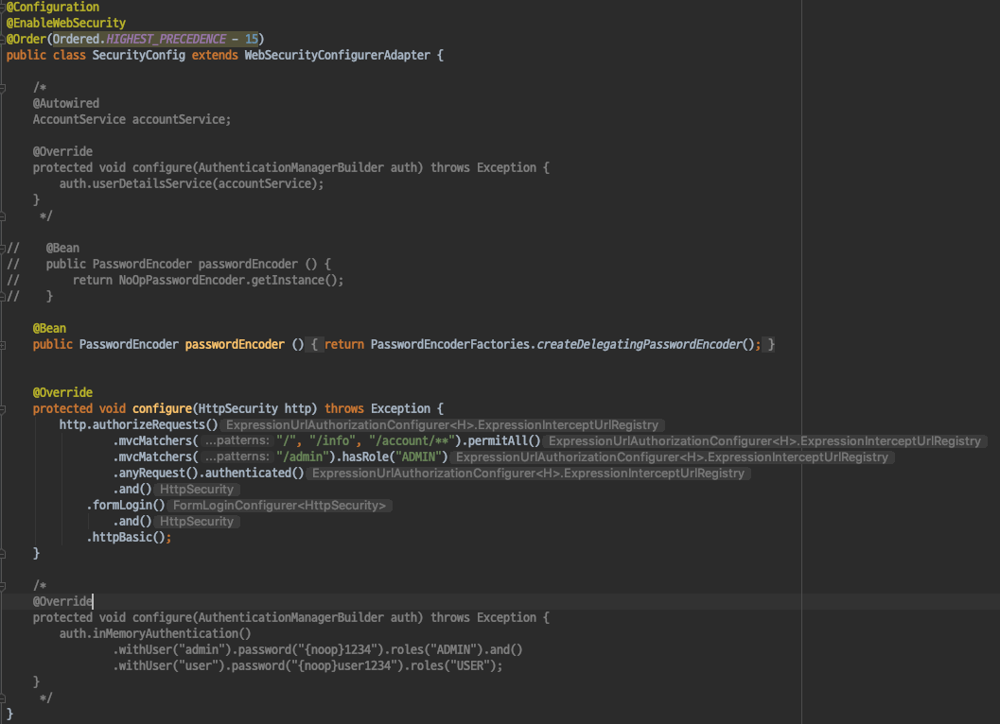

# Spring Security - ArcheTecher_Filter FilterChainProxy
- Spring Securty 가 제공하는 Filter와 FilterChainProxy

#### Spring Security가 제공하는 Filter들
- 1. WebAsyncManagerIntergrationFilter
- 2. `SecurityContextPersistenceFilter`
- 3. HeaderWriterFilter
- 4. CsrfFilter
- 5. LogoutFilter
- 6. `UsernamePasswordAuthenticationFilter`
- 7. DefaultLoginPageGeneratingFilter
- 8. DefaultLogoutPageGeneratingFilter
- 9. BasicAuthenticationFilter
- 10. RequestCacheAwareFilter
- 11. SecurityConetextHolderAwareRequestFilter
- 12. AnnoymousAuthenticationFilter
- 13. SessionManagementFilter
- 14. ExceptionTranslationFilter
- 15. FilterSecurityInterceptor

#### FilterChainProxy
- Spring Security에서 제공하는 Filter들을 호출하는 클래스이다.

- FilterChainProxy의 핵심 메서드
    - doFilter
    - doFilterInternal
    - getFilters

`doFilter`
- Spring Security를 사용하면 모든 요청은 FilterChainProxy 클래스를 거치게 된다.
- FilterChainProxy 도 Filter이기 때문에 doFilter Method를 거치게 된다.
- doFilter 메서드 내부에서는 최종적으로 doFilterInternal 메서드를 호출하는 역할을 한다.

`doFilterInternal`
- doFilterInternal 메서드에서는 getFilters 메서드를 호출하여 요청을 처리할 Filter목록을 불러온다.
- 만약 적합한 Filter가 존재하지 않는다면 FilterChainProxy의 역할은 종료된다.
- 적합한 Filter를 찾았다면 해당 Filter들을 VirtualFilterChain 클래스에게 위임한다.

`getFilters`
- getFilters 메서드에서는 SecurityFilterChain목록을 가져와 특정한 요청인 경우 (URL Pattern 이 일치하는 경우 등등..)해당 SecurityFilterChain의 Filter목록을 반환하는 역할을 한다.

`VirtualFilterChain`
- VirtualFilterChain 클래스는 doFilterInternal 로부터 위임받은 Filter들을 순서대로 실행 시켜주는 역할을 하게된다.

#### FilterChain 목록
- FilterChain 목록이 만들어지고 커스터마이징 되는 지점은 SecurityConfig 이다.
- WebSecurityConfigurerAdapter를 상속받은 SecurityConfig 클래스는 SecurityFilterChain을 만드는데 사용된다.

- SecurityConfig가 하나의 SecurityFilterChain이 된다고 생각하면 된다.
    - SecurityConfig에 따라 사용되는 Filter의 개수가 서로 다르다.
- 각각의 SecurityConfig가 다른 설정을 가지고 있는경우 다음과 같이 FilterChain이 사용할 Filter의 개수가 다른것을 확인할 수 있다.

- 즉 SecurityConfig가 여러개가 될수 있다는 얘기이다.
    - SecurityConfig가 여러개 일경우 다음과 같은 예외가 발생한다.

`예외가 발생하는 이유 ?`
- SecurityConfig를 하기위한 WebSecurityConfigurerAdapter 클래스의 우선순위는 유니크해야한다.
- 우선순위가 동일하고 서로의 설정이 상충될 경우를 사전에 방지한 것이다.

`서로의 설정이 상충되는 경우 란 ?`
- 우선순위가 동일하고, ASecurityConfig에서는 모든 요청을 허용하고, BSecurityConfig에서는 모든 요청에 인증을 필요로 하는 상태와 같은 경우를 말한다.

- SecurityConfig가 여러개 일경우 다음과 같이 @Order 애노테이션을 사용하여 순서를 지정해 주어야한다.
    - Security에서 서로의 설정이 상충되는 경우를 사전에 방지한 것이다.

#### 정리
- SpringSecurity를 사용한다면 모든 요청은 FilterChainProxy를 거치게 된다.
- FilterChainProxy에서 특정한 요청의 경우 우선순위와 URLPattern에 해당하는 SecurityChain을 찾아 해당 Chain의 Filter들을 가져와 이를 실행한다.
- SecurityConfig가 하나의 SecurityChain이며, 다수의 설정이 존재할 경우 반드시 우선순위를 지정해야한다.
