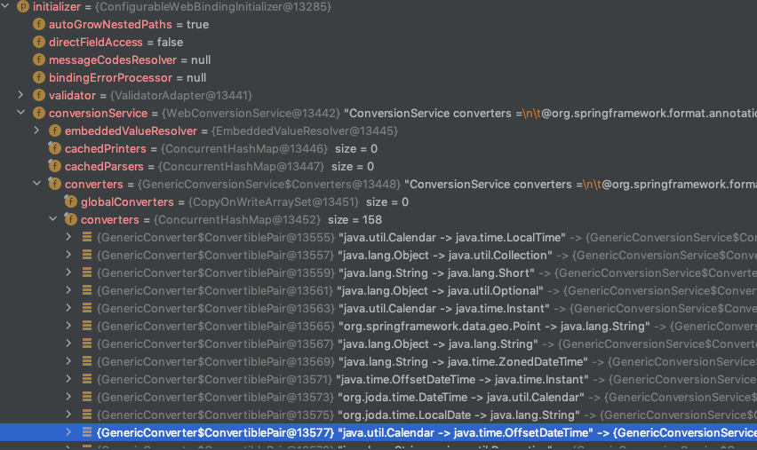

# StringToEnumConverterFactory

## Converter 와 Formatter
- Spring 에서 Type Conversion 을 지원하기 위한 인터페이스를 제공한다.
- Converter / Formatter
- 이 둘은 비슷하면서도 약간 다른데 차이점을 심플하게 정리하면 다음과 같다.

`Formatter 와 Converter 의 차이`
- Formatter 는 **문자열** 기반
- 문자열을 다른 타입으로 변환한다.
- 웹에 좀 더 특화되어있다
- Converter 는 모든 타입을 제공하며, 특정 타입을 다른 타입으로 변환한다.

스프링에서는 다양한 Converter 와 Formatter 들을 기본적으로 제공한다.



다양한 Converter 와 Formatter 들을 제공하지만, 이들을 사용해 실제 타입 변환이 일어나는 곳은 **ConversionService** 이다.

우리가 커스텀한 Converter 나 Formatter 를 구현한 뒤, 등록하면 스프링이 이를 사용하게 되는데, 스프링 MVC 기준으로는 WebMvcConfigurer 를 통해 수동으로 등록을 해주어야 한다. (혹은 특정 컨트롤러 에서만 사용한다면 @InitBinder 를 사용)

스프링 부트에서는 **WebConversionService** 라는 클래스를 제공해주며, Converter 나 Formatter 가 빈으로 등록되어 있다면 자동으로 등록을 해주는 클래스이다.

## 커스텀한 Converter Formatter 등록하기

`Converter Interface`
```Java
@FunctionalInterface
public interface Converter<S, T> {
    
	@Nullable
	T convert(S source);

}
```

`Formatter Interface`
```java
public interface Formatter<T> extends Printer<T>, Parser<T> {

}
```
- Converter 와 Formatter 인터페이스를 비교해 보면, Converter 인터페이스는 제네릭 인자를 둘을 받는다.
- Target 과 Source 타입의 제한이 없다는 것이 특징이다.
- Formatter 인터페이스는 제네릭 인자를 하나만 받으며, Printer 와 Parser 인터페이스를 구현해야 한다.
- Converter 와 비교했을때 String <-> Object 간의 변환을 담당한다는 차이가 있다.
- 웹의 경우 대부분 문자열로 처리되기 때문에 웹에 좀 더 특화되어 있다.

우리가 커스텀하게 생성한 Enum 을 대상으로 Converter 를 간단하게 구현한다고 하면 다음과 같을 것이다.

```java
enum PaymentType {
    KAKAOPAY,
    NAVERPAY,
    // etc..
}

class PaymentTypeConverter implements Converter<String, PaymentType> {
    public PaymentType convert(String value) {
        return PaymentType.valueOf(value);
    }
}
```

하지만 매번 새로운 타입의 Enum 이 생겨날때 마다 Converter 를 구현하고, 빈으로 등록하는것은 매우 비효율적이고 귀찮은 일이다.

이를 위해 스프링에서는 **StringToEnumConverterFactory** 클래스를 제공한다.

`StringToEnumConverterFactory`
```java
@SuppressWarnings({"rawtypes", "unchecked"})
final class StringToEnumConverterFactory implements ConverterFactory<String, Enum> {

	@Override
	public <T extends Enum> Converter<String, T> getConverter(Class<T> targetType) {
		return new StringToEnum(ConversionUtils.getEnumType(targetType));
	}


	private static class StringToEnum<T extends Enum> implements Converter<String, T> {

		private final Class<T> enumType;

		public StringToEnum(Class<T> enumType) {
			this.enumType = enumType;
		}

		@Override
		@Nullable
		public T convert(String source) {
			if (source.isEmpty()) {
				// It's an empty enum identifier: reset the enum value to null.
				return null;
			}
			return (T) Enum.valueOf(this.enumType, source.trim());
		}
	}

}
```
- 위 클래스는 스프링 3.0 부터 지원하였으며, String <-> Enum 간의 컨버터를 생성해주는 역할을 하기 때문에 새로운 Enum 이 추가되더라도 Converter 를 별도로 구현하지 않아도 된다. 